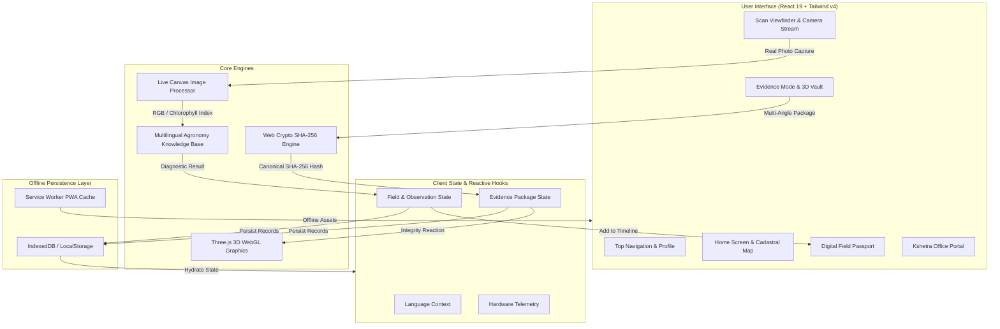

# 🌾 Kshetra — The Field That Remembers

<div align="center">


### *Understand. Act. Remember. Verify.*

[](https://opensource.org/licenses/MIT)
[](https://www.typescriptlang.org/)
[](https://react.dev/)
[](https://vitejs.dev/)
[](https://tailwindcss.com/)
[](https://developer.mozilla.org/en-US/docs/Web/API/Web_Crypto_API)
[](https://web.dev/progressive-web-apps/)
[](#-multilingual-agronomy)

**Kshetra** is an offline-first agricultural intelligence system that establishes **Evidence Continuity** for farming parcels. By pairing on-device diagnostic intelligence with cryptographic integrity seals, Kshetra builds an immutable **Digital Field Passport** across every season.

[Explore Demo Guide](./DEMO_GUIDE.md) · [Architecture](#-system-architecture) · [Pillars](#-the-three-pillars) · [Roadmap](#-technical-honesty--production-roadmap) · [Quick Start](#-quick-start)

</div>

---

## 🌾 The Problem: The Stateless AI Trap

Existing agricultural applications operate statelessly:
> *"Your crop has Paddy Leaf Curl. Spray chemical X."*

This fails both farmers and financial institutions:
- ❌ **No History**: The app doesn't know what the parcel looked like 14 days ago.
- ❌ **No Accountability**: There is no verified audit trail of whether recommended remedies were applied.
- ❌ **No Recovery Tracking**: Did the crop recover, or did symptoms worsen?
- ❌ **Zero Fraud Resistance**: Standard photos can be forged, re-used, or altered for false crop insurance claims.

---

## 💡 The Solution: Evidence Continuity

**Kshetra** transforms disconnected disease scans into an unbroken **chain of agricultural proof**:

```
┌──────────────┐     ┌──────────────┐     ┌──────────────┐     ┌──────────────┐
│  1. SCAN     │ ──► │  2. ANALYZE  │ ──► │  3. ACT      │ ──► │  4. TRACK    │
│  Real Camera │     │  Severity %  │     │  Action Log  │     │  Chronology  │
└──────────────┘     └──────────────┘     └──────────────┘     └──────────────┘
                                                                      │
┌──────────────┐     ┌──────────────┐     ┌──────────────┐            ▼
│  7. VERIFY   │ ◄── │  6. SIGN     │ ◄── │  5. SEAL     │ ◄── ┌──────────────┐
│  Audit Proof │     │  SHA-256 Key │     │  Multi-Angle │     │  REMEMBER    │
└──────────────┘     └──────────────┘     └──────────────┘     │  Ledger      │
                                                               └──────────────┘
```

1. **What the field looked like before**: Baseline vegetative vigor, tillering stages, and healthy canopy benchmarks.
2. **What changed**: Early pathogen emergence, moisture stress, or catastrophic storm lodging.
3. **What was detected**: Multi-condition foliar diagnosis with severity percentage and confidence rating.
4. **What action was taken**: Interventions linked directly to specific observations (e.g. organic neem spray, ridge drainage).
5. **What happened afterward**: Chronological recovery monitoring, canopy leaf flattening, and yield resilience.
6. **Verifiable proof**: Cryptographically sealed evidence packages backed by browser Web Crypto SHA-256 digests and motion telemetry.

---

## 🏛️ The Three Pillars

### 1. 🔍 UNDERSTAND — Crop-Health Intelligence
*Real-time foliar analysis built on controlled agronomic heuristics.*

- **Dual-Capture Architecture**:
  - **Live Camera Pipeline**: Auto-starts the device camera stream, captures real photographic frames (`PHOTO CAPTURED`), and samples live canvas RGB pixel data and chlorophyll greenness ratios for adaptive diagnostics.
  - **Curated Demo Presets**: Explicitly identified as `DEMO SPECIMEN SELECTED` (Leaf Curl, Storm Lodging, Healthy Leaf) for benchmark presentations.
- **Transparent 5-Stage Analysis Pipeline**:
  `Reading Image` ➔ `Identifying Crop` ➔ `Assessing Foliar Condition` ➔ `Estimating Severity` ➔ `Preparing Agronomy Guidance`.
- **Controlled Agronomic Knowledge Base**: Structured recommendations authored with agricultural extension best practices in English, Hindi, and Telugu. **Strictly prohibits unvetted or hazardous chemical overdosing.**

### 2. 📖 MANAGE — Living Digital Field Passport
*A chronological, verifiable timeline of everything a parcel experiences.*

- **Dynamic Field Story**: Vertical ledger recording sowing events, regular baseline health checks, pest infestations, remedial actions, and post-treatment recovery.
- **Dynamically Derived Health Metrics**:
  - Eliminates hardcoded metrics: Health score (`19%` on severe lodging), status alerts (`"Significant Damage Detected"`), and `Last Scan` dates (`2 Sep 2026` or `"Just now"`) are computed in real time from the active dataset.
- **Strict Data Consistency**: Real-time counter synchronization across all views (e.g. `4 Observations · 6 Total Events`).
- **Complete Deletion Lifecycle**: Full user sovereignty with confirmation modals to delete or prune local records.

### 3. 🛡️ VERIFY — Cryptographic Evidence & Tamper Detection
*Tamper-proof evidence packages for crop insurance adjusters, lenders, and certification boards.*

- **High-Contrast Security Mode**: Dedicated multi-angle capture flow (Angles 1, 2, and 3) documenting field damage with hardware GPS coordinates and motion stability telemetry.
- **Client-Side SHA-256 Cryptographic Sealing**: Generates canonical JSON digests using the native browser `crypto.subtle.digest('SHA-256')` Web Crypto API.
- **Interactive WebGL Tamper Vault Monolith (`Cryptographic3DBlock`)**:
  - **Verified State**: Luminous emerald crystal lattice (`#00E676`), orbital energy rings, and unbroken facets.
  - **Tampered State**: Instantly turns crimson alert (`#FF1744`), projecting physical fracture cracks through the crystal geometry and erupting in warning spark particles!
- **The Hackathon Hero Demo**:
  - `Simulate Tamper`: Subtly alters the payload data post-sealing.
  - `Verify Integrity`: Instant mathematical mismatch detection triggering `✗ HASH MISMATCH`.
  - `Restore Original`: Reconstructs original data payload, restoring `✓ INTEGRITY VERIFIED`.

---

## 🗺️ Spatial Cadastral Intelligence & 3D Twins

Kshetra bridges ground-level camera observations with high-precision geospatial cadastral boundaries:

```
┌─────────────────────────────────────────────────────────────┐
│                   KSHETRA SPATIAL TWIN                      │
│                                                             │
│   2D Cadastral Boundary (Home)      3D Digital Twin (Fields)│
│   • WGS84 Survey Peg Coordinates    • Procedural Parcel Mesh│
│   • Live GPS Accuracy Radius (±m)   • Multispectral NDVI    │
│   • Satellite & Terrain Overlays    • Topographical Contours│
│   • Real-Time Geofence Indicator    • 360° Drone Orbit Cam  │
└─────────────────────────────────────────────────────────────┘
```

- **Home Cadastral Map (`CadastralMap.tsx`)**:
  - Clean, high-resolution 2D satellite cadastral boundary map with survey pegs, WGS84 coordinates, and layer switcher.
- **3D Digital Twin Viewer (`Cadastral3DViewer.tsx`)**:
  - Procedural parcel elevation mesh for parcels (`KR-1042`, `KR-1043`, `KR-1044`).
  - **Multispectral Shaders**:
    - `NDVI`: Thermal chlorophyll canopy gradient (emerald optimal `>0.8`, amber moderate, and crimson stress zones).
    - `Satellite`: High-definition photorealistic agricultural bund texturing.
    - `Contours`: Topographical elevation contour wireframes.
  - **Laser Perimeter & Centroid Beacon**: Pulsing boundary perimeter with rotating holographic coordinate beacon.
  - **Cinematic Drone Flyover**: Smooth 360° orbital camera control with pitch and altitude adjustments.

---

## 🏢 Kshetra Office — Stakeholder Audit Portal

Kshetra includes a built-in stakeholder command center for bank agricultural officers, crop insurance adjusters, and cooperative managers:

- **Field Portfolio Overview**: Instant health status of enrolled parcels.
- **Checksum Audit Ledger**: View all sealed evidence packages, original SHA-256 hashes, timestamps, and hardware sensor stability.
- **Dynamic Tamper Alerts**: Automatically reflects package status — toggling from `Field Passport: Active` to `Integrity Issue Detected` if any local record fails SHA-256 verification.
- **Full Operational Activity Log**: Complete historical record of every farmer scan and agronomic action.

---

## 🔒 Technical Honesty & Architecture Boundaries

We maintain strict engineering honesty regarding what runs in this web prototype versus the production native roadmap:

| System Layer | Current Web Prototype (POC) | Production Native Android Target |
| :--- | :--- | :--- |
| **Cryptographic Integrity** | Browser Web Crypto API `crypto.subtle.digest('SHA-256')` | Android Keystore Hardware-Backed TEE Private Key Signing |
| **Vision AI** | Live canvas RGB sampling + rule-based foliar heuristics | Jetpack CameraX + LiteRT (TensorFlow Lite) on-device models |
| **Agronomic Guidance** | Controlled agronomy rulebase in EN / HI / TE | On-device lightweight LLM (Gemma 3n / LiteRT-LM) |
| **Location & Geofencing** | HTML5 Geolocation API with accuracy meter (Default: "Location not set") | Google Play Services Fused Location Provider |
| **Local Storage** | Browser LocalStorage + IndexedDB with JSON serialization | Room SQLite Database with SQLCipher 256-bit encryption |
| **Offline Resilience** | Service Worker PWA Cache (`sw.js`) + manual offline toggle | WorkManager background synchronization queue |

> [!NOTE]
> **Zero Fabricated Locations**: Kshetra never hardcodes artificial coordinates. Default location is `"Location not set"`. Real coordinates (`lat`, `lng`, `±accuracy`) are captured only after explicit user permission. Demo parcels are explicitly marked `DEMO`.

---

## 🏗️ System Architecture



---

## 🚀 Quick Start

### Prerequisites
- **Node.js**: v18.0 or higher
- **npm**: v9.0 or higher

### Installation & Development

```bash
# 1. Clone repository
git clone https://github.com/pavankarthikeyaatchyuta-lab/Kshetra.git
cd Kshetra

# 2. Install dependencies
npm install

# 3. Start development server
npm run dev
```

Visit `http://localhost:5173/` in your browser.

### Production Build & Verification

```bash
# Run TypeScript compilation and Vite production bundle
npm run build

# Preview production build locally
npm run preview
```

---

## 📱 Mobile-First Design & Viewports

Kshetra is engineered mobile-first to ensure flawless performance on rural smartphones:
- **Target Mobile Viewports**: `360×800` (Budget Android), `390×844` (Standard), `412×915` (Large Android), `430×932` (Pro Max).
- **Responsive Desktop**: Adapts seamlessly to tablet and desktop monitors with sidebars and expanded command center layouts.
- **Color Palette**: Earthen agronomic design token system:
  - Deep Forest Canopy: `#0C2518`
  - Agricultural Green: `#2E7D32`
  - Sacred Earth / Canvas: `#FBF9F4`
  - Sand / Border: `#EAE4D5`
  - Alert Red: `#D32F2F`
  - Warning Amber: `#E65100`

---

## 🌐 Multilingual Agronomy

Kshetra natively supports three major languages with complete parity across diagnostic classifications, foliar observations, next-step recommendations, and technical UI:

| Code | Language | Native Script | Coverage |
| :---: | :--- | :--- | :--- |
| `en` | English | English | 100% UI, Diagnosis, Remedial Steps, Office |
| `hi` | Hindi | हिन्दी | 100% UI, Diagnosis, Remedial Steps, Office |
| `te` | Telugu | తెలుగు | 100% UI, Diagnosis, Remedial Steps, Office |

---

## 📂 Project Structure

```
Kshetra/
├── public/
│   ├── favicon.svg              # Sacred leaf + agricultural furrow emblem
│   ├── manifest.webmanifest     # PWA progressive web app manifest
│   ├── sw.js                    # Service worker offline caching
│   ├── paddy-banner.svg         # High-resolution paddy field cinematic asset
│   ├── satellite-field.svg      # Cadastral satellite parcel overlay
│   ├── sample-healthy.svg       # Reference healthy monocot leaf
│   ├── sample-leafcurl.svg      # Reference paddy leaf curl specimen
│   └── sample-storm.svg         # Reference storm damage lodging specimen
├── src/
│   ├── components/
│   │   ├── dashboard/           # HealthSummaryCard, WeatherCard, SystemStatusCard, QuickActions
│   │   ├── evidence/            # Cryptographic3DBlock (WebGL glass monolith)
│   │   ├── map/                 # CadastralMap (2D satellite) & Cadastral3DViewer (3D mesh)
│   │   ├── navigation/          # AppHeader, BottomNav, LanguagePicker
│   │   ├── splash/              # Animated brand launch splash screen
│   │   └── ui/                  # KshetraLogo and brand badges
│   ├── models/
│   │   └── types.ts             # Domain models (Field, Observation, EvidencePackage)
│   ├── screens/
│   │   ├── HomeScreen.tsx       # Field summary, dynamic health score & Field Story
│   │   ├── ScanScreen.tsx       # Real camera viewfinder, canvas heuristics & 5-step analysis
│   │   ├── PassportScreen.tsx   # Digital Field Passport living timeline & deletion
│   │   ├── EvidenceScreen.tsx   # Evidence Mode, SHA-256 sealing & tamper simulation
│   │   ├── OfficeScreen.tsx     # Stakeholder audit command center
│   │   ├── FieldsScreen.tsx     # Parcel holdings selector & 3D Cadastral Digital Twin
│   │   ├── InsightsScreen.tsx   # Agronomic telemetry & NDVI canopy analytics
│   │   └── MoreScreen.tsx       # System permissions, hardware diagnostics & language
│   ├── services/
│   │   ├── crypto.ts            # Canonical JSON serializer & Web Crypto SHA-256
│   │   ├── hardware.ts          # Geolocation & device motion sensors
│   │   ├── i18n.ts              # Trilingual agronomy knowledge base (EN, HI, TE)
│   │   └── storage.ts           # IndexedDB & LocalStorage persistence with sample datasets
│   ├── App.tsx                  # Top-level application shell and router
│   ├── index.css                # Tailwind CSS v4 design system
│   └── main.tsx                 # Application mount & service worker bootstrap
├── DEMO_GUIDE.md                # 90-Second Hackathon Judge Walkthrough
├── package.json
├── tsconfig.json
└── vite.config.ts
```

---

## ⏱️ Judge Walkthrough Guide

Presenting Kshetra in a hackathon or technical demo?  
Follow our step-by-step 90-second judge demonstration script:  
👉 **[Read DEMO_GUIDE.md](./DEMO_GUIDE.md)**

---

## ⚖️ License

Distributed under the **MIT License**. Built for agricultural resilience, transparency, and verifiable field evidence.
